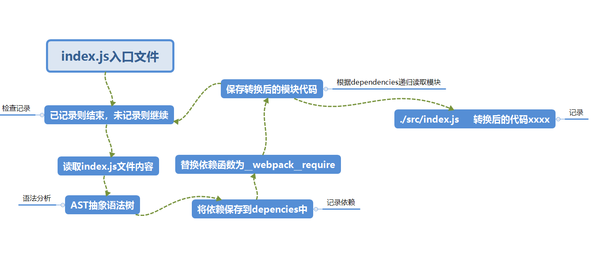

# 编译过程

## 初始化

融合配置，将 CLI 参数，配置文件，默认配置进行融合，形成一个最终的配置对象

## 编译

1. 创建 chunk
   根据入口模块找到的所有的依赖，一起统称为 chunk，
   chunk 可以有多个，因为可以有多个入口文件
   每个 chunk 至少有两个属性
   - name:默认为 main
   - id:唯一编号，在开发环境下和 name 一样，若是生产环境则由 0 依次
2. 构建所有的依赖模块

main chunk

不仅将require改成__webpack_require
还将require('改为模块的id')
形成抽象语法树或分析语法是否错误，错误则无法形成抽象语法树

3. 产生 chunk assets
   在第二步完成后，chunk 中会产生一个模块列表，列表中包含了模块 id 和模块转换后的代码，
   此时 webpack 根据模块列表生产 chunk assets
   文件名               文件内容
   ./dist/main.js      xxxxxxxxxx((function(modules){})({文件id : function(){转换后模块的代码},...}))
   ./dist/main.js.map  xxxxxxx(看配置)(其中的一项称之为bundle)
    chunk hash         xxxxxxxxxx

chunk hash是根据所有chunk assets的内容生成的一个hash字符串
4. 将所有的chunk assets(多个chunk生成多个模块列表，生成多个chunk assets)合并，形成一个总的资源列表，然后根据总的资源列表生成一个总的hash
5. 输出根据总的资源列表输出到文件

## 术语
hash 表示总的资源hash
chunkhash：chunk生成的资源清单内容联合生成的hash
chunkname: chunk的名称，如果没有配置则使用main