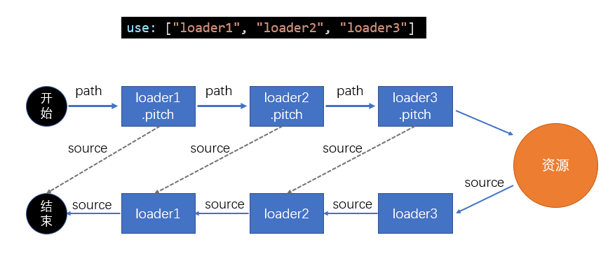

// 缩短重新打包的时间

# 优化 loader 性能

## 进一步限制 loader 的范围

例如 bable-loader,有些库本身就没有使用 es5 以上的语法，所以不需要 loader 转换
通过 module.rules.exclude 进行排除不需要转换的文件

## 缓存 loader 的结果

将 loader 处理之后的结果缓存下来，当文件没有发生变化时，使用缓存的结果
可以在第一个加上 cache-loader

## 为 loader 的运行开启多线程

使用 thread-loader 将后面的 loader 放入到线程池中
由于后续的 loader 会放入到新的线程中，所以，后续的 loader 不能使用

- 使用 webpack api 例如生成文件 this.emitFile()
- 无法使用自定义的 plugin api
- 无法访问 webpack options

**在小型项目中反而会增加时间，因为开启线程和管理线程也需要时间**

# loader(详细)

use:["loader1","loader2","loader3"]
loader1.pitch(可返回，可不返回，如果返回，返回源代码)
开始时，先将 path 给 loader1.pitch-->loader2.pitch-->loader3.pitch
如果 loader1.pitch 返回，则直接进入下一步，抽象语法树分析
cache-loader.pitch 发现有缓存，则直接返回缓存的代码
