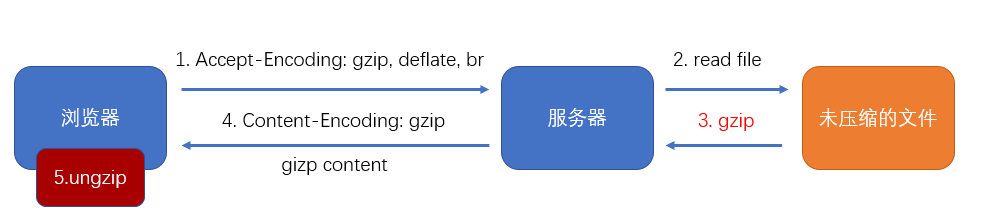
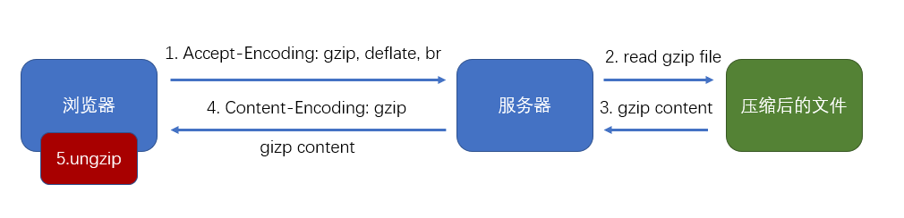

# gzip

gzip 是一种压缩文件的算法
B/S 结构中的压缩传输

Accept-Encoding:gzip br deflate(浏览器接收的压缩算法)
Content-Encodeing:gzip(响应头的字段，压缩)
优点：传输效率可能得到大幅度提升
缺点：服务器压缩需要时间，客户端解压需要时间

## 使用 webpack 进行压缩(额外产生 js.gz 文件)

使用 compression-webpack-plugin 插件对打包结果进行预压缩，可以移除服务器的压缩时间

缺点：降低了服务器的灵活度

过程，如果是 gzip,则服务器检查有没有该文件的.gzip 文件，则读取该文件的内容
